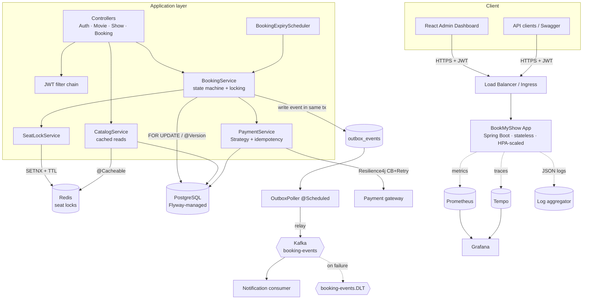
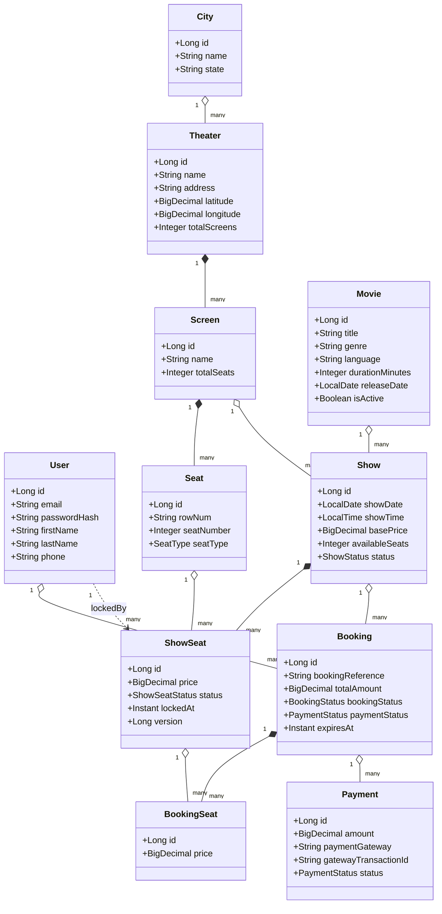
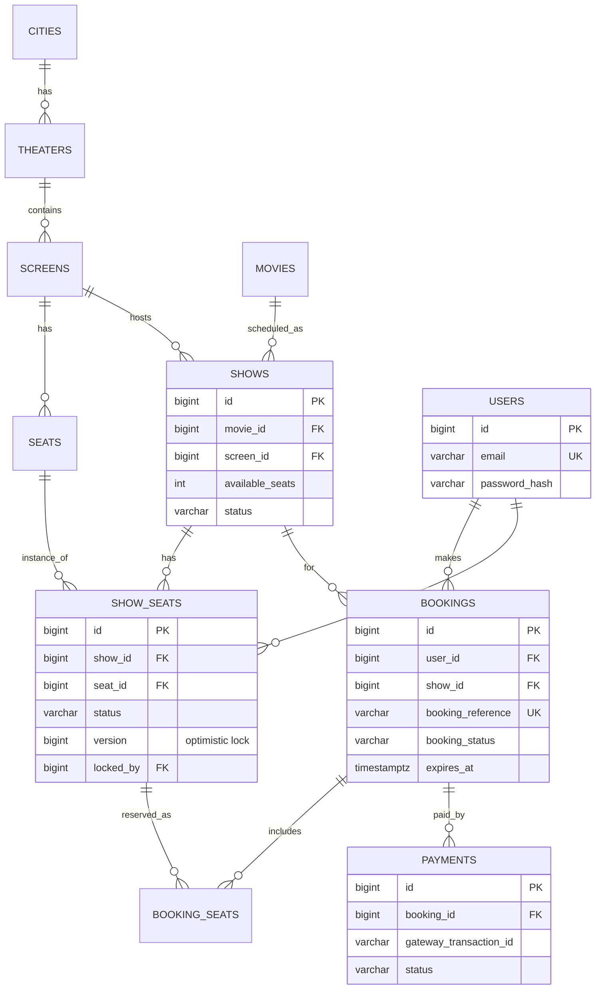
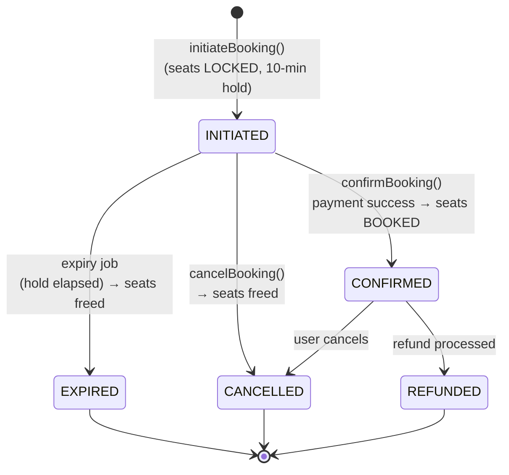

# BookMyShow — Diagrams

Mermaid diagrams (render natively on GitHub). Generated from the actual entities under
`src/main/java/com/umang/bookmyshow/model/entity/` and the service layer.

- [1. High-Level Design (HLD)](#1-high-level-design-hld)
- [2. UML Class Diagram](#2-uml-class-diagram)
- [3. Entity-Relationship Diagram](#3-entity-relationship-diagram)
- [4. Booking State Machine](#4-booking-state-machine)

---

## 1. High-Level Design (HLD)

---

## 2. UML Class Diagram

---

## 3. Entity-Relationship Diagram

---

## 4. Booking State Machine

