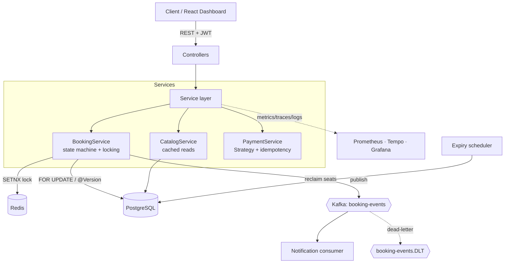
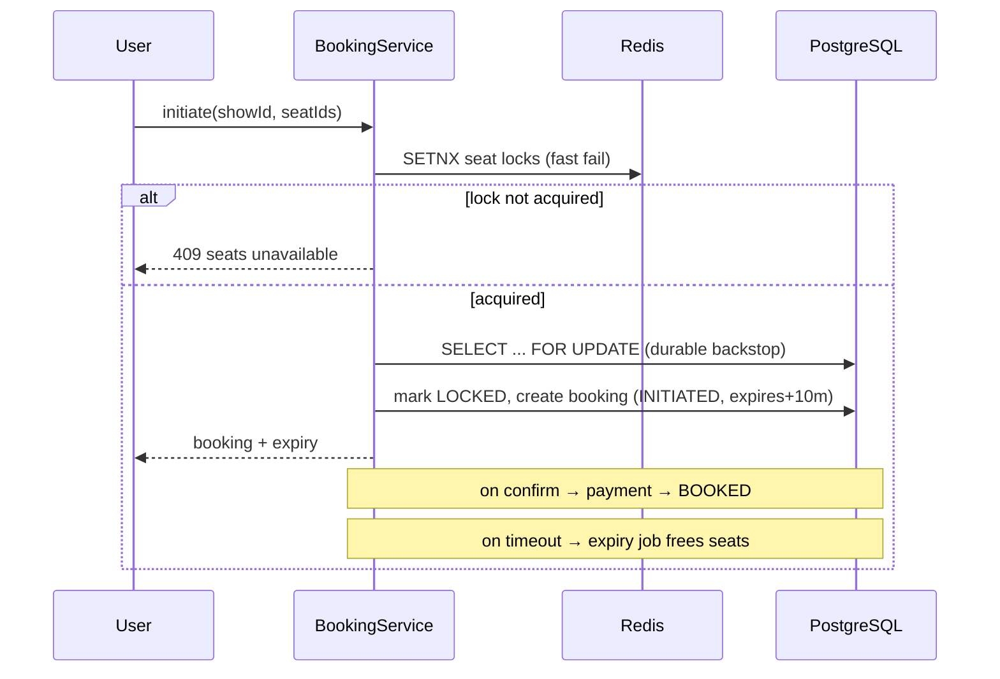

# BookMyShow Backend

> A ticket-booking backend (Spring Boot 3.3.5 / Java 21) focused on **correctness under
> concurrency** — two-layer seat locking, transactional booking, a booking state machine,
> event-driven notifications over Kafka, and full observability.


This is a **modular monolith by design** — the booking flow is one cohesive, consistency-
critical transaction, so it belongs in a single service rather than split into
microservices. (The microservices / SAGA / Resilience4j showcase lives in the sibling
[UPI Payment System](../upi-payment-system), where the domain genuinely is distributed.)
Knowing *when not to* reach for microservices is a deliberate part of this project.

---

📐 **Diagrams:** HLD, UML class, ER, and the booking state machine (Mermaid) →
[DIAGRAMS.md](DIAGRAMS.md)

## What's inside

| Area | Highlights |
|---|---|
| **Concurrency** | Two-layer seat lock: Redis `SETNX` fast-fail + DB pessimistic (`SELECT … FOR UPDATE`) & optimistic (`@Version`) locking. Proven under a 20-thread race test. |
| **Booking** | Initiate → confirm → cancel with an enforced state machine; 10-minute hold with a scheduled expiry job that reclaims seats. |
| **Payments** | Strategy + Factory over payment gateways; idempotency keys; saga-style confirmation. |
| **Eventing** | Booking events via the **transactional Outbox** (event row committed with the state change; `OutboxPoller` relays to **Kafka**), dead-letter topic, notification consumer. |
| **Resilience** | **Resilience4j** circuit breaker + retry + fallback on the payment-gateway call; **AOP** aspect for service-layer timing/logging. |
| **Security** | Spring Security 6, JWT auth, BCrypt password hashing. |
| **Observability** | Micrometer → Prometheus metrics, Micrometer Tracing → OpenTelemetry, JSON structured logs + correlation IDs, a Grafana dashboard. See [`observability/`](observability/). |
| **Data** | PostgreSQL + Flyway migrations (Hibernate `validate`); Redis for locks. |
| **Quality** | Unit tests (Mockito) + integration tests (Testcontainers); GitHub Actions CI; multi-stage Docker; K8s manifests. |
| **UI** | React + TypeScript admin dashboard → [`bookmyshow-dashboard`](../bookmyshow-dashboard). |

---

## Architecture



### Seat-booking flow (the core concurrency story)



Deeper design docs: **[HLD.md](HLD.md)** · **[LLD.md](LLD.md)** (class/sequence diagrams,
state machines, patterns).

---

## Tech stack

**Backend:** Java 21 · Spring Boot 3.3.5 · Spring Data JPA · Spring Security 6 · Spring Kafka · Flyway
**Data:** PostgreSQL 17 · Redis 7
**Observability:** Micrometer · Prometheus · OpenTelemetry · Grafana · Tempo
**Infra:** Docker (multi-stage) · Kubernetes · GitHub Actions CI

---

## Quick start

**Prerequisites:** JDK 21 (Temurin or Corretto) — build/tests need JDK 21 (Mockito's
inline mock maker breaks on JDK 25) · Maven · Docker Desktop (for Postgres + Redis).

```bash
# 0. Clone
git clone https://github.com/guptaumang769/book-my-show-backend.git
cd book-my-show-backend

# 1. Start dependencies (compose starts postgres + redis)
docker compose up -d

# 2. Run the app on :8080 (Flyway builds the schema, seeds demo data)
mvn spring-boot:run

# 3. Explore
open http://localhost:8080/swagger-ui.html      # interactive API
curl localhost:8080/actuator/health              # health
```

To run the API + dashboard together, see [`bookmyshow-dashboard`](../bookmyshow-dashboard).
For the metrics/tracing stack: `docker compose -f observability/docker-compose.observability.yml up -d`.

**Run without Docker:** point `application.yml` at your own Postgres + Redis (or start
just those two with `docker compose up -d postgres redis`) and run the app from your IDE —
launch `BookMyShowApplication` with a JDK 21 SDK.

### Example: initiate a booking

```bash
POST /api/v1/bookings/initiate
{ "userId": 1, "showId": 1, "seatIds": [1, 2, 3] }
```

---

## Testing

```bash
mvn test        # fast unit tests (no Docker)
mvn verify      # + Testcontainers integration tests (needs Docker)
```

> **JDK 21 for tests.** Mockito breaks on JDK 25, so point `JAVA_HOME` at a JDK 21 before
> running tests. macOS/Linux: `JAVA_HOME=$(/usr/libexec/java_home -v 21) mvn test`.
> Windows (PowerShell): `$env:JAVA_HOME="C:\Program Files\Eclipse Adoptium\jdk-21"; mvn test`.

The headline integration test — `BookingConcurrencyIT` — fires **20 threads at the same
seat** and asserts exactly one wins, proving the locking prevents double-booking.

---

## How it scales

Reads scale horizontally (cached catalog queries, stateless app behind the
[K8s HPA](k8s/04-app.yaml), optional Postgres read replica). The write hot path is the seat
lock on a popular show — the Redis fast-fail lock keeps most contention off the DB, seats
partition naturally by `show_id`, and the denormalized `available_seats` counter uses an
atomic `UPDATE`. At extreme scale a blockbuster show becomes a hot partition you'd move to
a dedicated shard. Full reasoning + the "when not to use microservices" framing is in
[HLD.md](HLD.md).

---

## Design docs

- **[HLD.md](HLD.md)** — high-level design: requirements, capacity estimates, architecture, scalability
- **[LLD.md](LLD.md)** — low-level design: class/sequence diagrams, design patterns, transaction isolation, API specs
- **[DIAGRAMS.md](DIAGRAMS.md)** — HLD, UML class, ER, and booking state-machine diagrams (Mermaid)

---

## Author

**Umang Gupta** — backend engineer
[LinkedIn](https://www.linkedin.com/in/umang1395/) ·
[GitHub](https://github.com/guptaumang769) ·
[LeetCode](https://leetcode.com/u/umang_g/)

_MIT License — free to use for learning._
